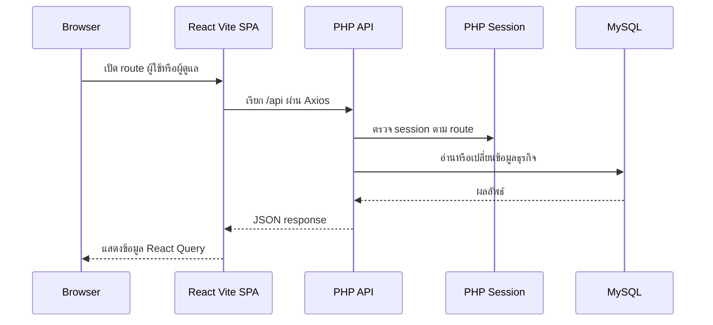

# สถาปัตยกรรมรันไทม์และขอบเขตของสถานะ

repository แยกเป็น SPA ใน `frontend/`, PHP API ใน `backend/` และ schema MySQL ใน `specs/database/schema.sql` React ใช้ Axios และ React Query เรียก API ที่มี route ธุรกิจจริง; ข้อมูลแคตตาล็อก, บัญชี, คำสั่งซื้อ และการจัดเตรียมเก็บใน MySQL ขณะที่ตะกร้ายังเก็บในเบราว์เซอร์เพื่อคงรายการก่อน checkout. การตรวจรูปสลิปออกจาก PHP ไป Slip2Go เท่านั้น เพื่อให้ API key ไม่ออกสู่ SPA.

ภาพนี้แสดง flow ของข้อมูลที่ใช้ร่วมกัน: [workflow คำสั่งซื้อ](../workflows/orders-and-fulfillment.md) ใช้ API และ transaction เพื่อเปลี่ยนข้อมูลใน [โมเดล domain](../domain-model.md) ไม่ใช่ store ผู้ดูแลในเครื่อง.

## องค์ประกอบของ frontend

`frontend/src/main.tsx` mount React ด้วย `QueryClientProvider`; query มี `staleTime` 30 วินาที, refetch เมื่อ focus และ retry หนึ่งครั้ง `MutationCache` invalidate `adminBadgeCountsKey` หลัง mutation สำเร็จ เพื่อให้ badge ผู้ดูแลอัปเดตจากจุดเดียว

`frontend/src/app/router.tsx` มี `UserLayout` สำหรับ `/`, `/order-summary`, `/my-orders`, `/my-chats`, `/my-profile` และใช้ `AdminAuthGuard` ครอบ route `/admin` ทั้งหมด โดยหน้า `/admin/login` อยู่นอก guard. API client แยกตามบทบาทใน `frontend/src/api/user/` และ `frontend/src/api/admin/`; ทุกโมดูลใช้ `frontend/src/lib/axios.ts` ซึ่งตั้ง base URL เป็น `VITE_API_URL` หรือ `/api`, ขอ JSON และแปลง error response เป็น `Error` ภาษาไทย.

## ความเป็นเจ้าของสถานะ

| สถานะ | เจ้าของ | ขอบเขต |
| --- | --- | --- |
| ตะกร้า | `frontend/src/stores/cart-store.ts` | Zustand persist ในเบราว์เซอร์; ส่ง `{ productId, quantity }` เมื่อสร้าง order |
| บัญชีผู้ใช้และผู้ดูแล | `users`/`admin`, PHP session | API login/register และ cookie session; ผู้ดูแลมี guard ฝั่ง React และ gate `/admin/*` ฝั่ง PHP |
| แคตตาล็อก, จุดรับ, แบนเนอร์, การตั้งค่า | MySQL ผ่าน API | React Query fetch/mutation จากฟีเจอร์ที่เกี่ยวข้อง |
| คำสั่งซื้อ, การชำระเงิน, สต็อก | `orders`, `order_items`, `order_payments`, `products` | สร้าง order ใน transaction และ lock สินค้าก่อนตัดสต็อก; สลิปเก็บนอก web root และ PHP ส่งตรวจ Slip2Go |
| รอบเตรียมและงานส่ง | `preparation_groups` และ `orders` | API บังคับเงื่อนไข status ก่อนสร้าง/ปิดรอบ/ส่งแล้ว |
| badge ผู้ดูแล | API dashboard + React Query | query ทุก 30 วินาทีเฉพาะเมื่อ `isBadgeNotificationEnabled` เปิด |
| โควตาตรวจสลิป | API dashboard, Slip2Go และ React Query | PHP เรียกข้อมูลบัญชีโดยถือ secret; frontend poll ทุก 5 นาทีเฉพาะเมื่อ `isSlipQuotaAlertEnabled` เปิด |

## การกำหนดเส้นทางคำขอและการยืนยันตัวตน

`frontend/vite.config.ts` proxy `/api` ไป `http://localhost:8000` ระหว่างพัฒนา และ `frontend/public/.htaccess` กัน `/api/` ไว้ให้ PHP พร้อม rewrite route อื่นกลับ `index.html`.

`backend/public/api/index.php` โหลด route modules สำหรับ auth, สินค้า, จุดรับ, แบนเนอร์, settings, profile, users, messages, orders, dashboard, order cleanup และ preparations. เมื่อ path เริ่ม `/admin/` จะเรียก `admin_auth_current(app_db())` ก่อน dispatch resource; user order route ตรวจ `user_auth_current` เองเพื่อจำกัดเจ้าของ order. `backend/src/admin/auth/session.php` และ `backend/src/user/auth/session.php` ตั้ง cookie เป็น `HttpOnly`, `SameSite=Lax`, ใช้ strict session mode และ regenerate ID ตอน login; admin มี optional remember อายุ 30 วัน.

PHP ติดต่อ MySQL ผ่าน `backend/src/shared/database.php`; [การดำเนินการ](../operations.md#การตั้งค่าและจุดเชื่อมต่อระบบ) ระบุวิธีรันและตรวจ route ขณะที่ [โมเดล domain](../domain-model.md) อธิบายตารางและสถานะที่ API ใช้.
