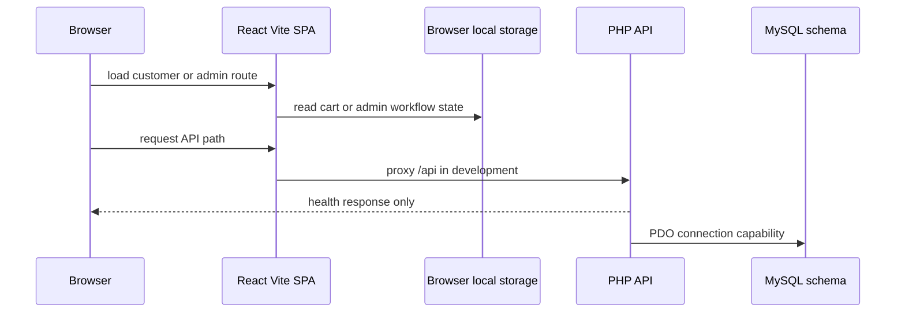

# สถาปัตยกรรมรันไทม์และขอบเขตของสถานะ

repository แยกออกเป็น SPA ในเบราว์เซอร์ (`frontend/`), โครง PHP API (`backend/`) และ MySQL schema (`database/`) แอป React เปิด route สำหรับลูกค้าและผู้ดูแลไว้แล้ว แต่ข้อมูลธุรกิจที่ใช้งานอยู่เป็นแบบ static หรืออยู่ในเบราว์เซอร์ ส่วนโปรเซส PHP ปัจจุบันเปิดเพียง health endpoint จึงยังไม่ใช่แหล่งอ้างอิงเบื้องหลังแคตตาล็อก, การชำระเงิน หรือคิวฝั่งผู้ดูแลที่แสดงผล

ภาพนี้แสดงขอบเขตรันไทม์ในปัจจุบัน: MySQL ถูกนิยามไว้และ PHP สามารถสร้างการเชื่อมต่อ PDO ได้ แต่ไม่มี route ที่ตรวจสอบใดทำงานเชิงธุรกิจโดยอิงฐานข้อมูล

## องค์ประกอบของ frontend

`frontend/src/main.tsx` mount React ในโหมด strict และจัดเตรียมทั้ง `QueryClientProvider` และ React Query devtools ค่าเริ่มต้นของ query ใช้ stale time 30 วินาที, refetch เมื่อ window ได้ focus และ retry หนึ่งครั้ง provider นี้เป็นโครงสร้างพื้นฐานสำหรับการเข้าถึงข้อมูลระยะไกลในอนาคต: ไม่มีฟีเจอร์ที่ตรวจสอบใดเรียกใช้ React Query หรือ API helper แบบทั่วไป

`frontend/src/app/router.tsx` ใช้ `BrowserRouter` และแยกโครงภาพออกเป็นสองส่วน:

- `CustomerLayout` ให้บริการ `/`, `/order-summary` และ `/my-orders`
- `/admin/login` แยกเป็นอิสระ; `AdminLayout` รองรับ route ของแดชบอร์ด, แคตตาล็อก/การตั้งค่า, คำสั่งซื้อ, การเตรียมสินค้า, ผู้ใช้/แชท, การจัดส่ง, แบนเนอร์, การตั้งค่า และโปรไฟล์ ภายใต้ `/admin`
- path สาธารณะที่ไม่รู้จักจะ redirect ไปยัง `/`; route ลูกฝั่งผู้ดูแลที่ไม่รู้จักจะแสดง placeholder ของการเตรียมสินค้า

[แผนผังซอร์สโค้ด](../source-map.md) เป็นวิธีที่เร็วที่สุดในการค้นหาหน้าและโมดูลฟีเจอร์เบื้องหลัง route การกำหนดเส้นทางฝั่งลูกค้าและผู้ดูแลต่างป้อนเข้าสู่ [workflow คำสั่งซื้อและการจัดส่ง](../workflows/orders-and-fulfillment.md) แต่ปัจจุบันยังไม่ได้ใช้ระเบียนคำสั่งซื้อฝั่งเซิร์ฟเวอร์ร่วมกัน

## ความเป็นเจ้าของสถานะ

| สถานะ | เจ้าของปัจจุบัน | การเก็บข้อมูล / ข้อจำกัด |
| --- | --- | --- |
| ตะกร้าฝั่งลูกค้า | `frontend/src/stores/cart-store.ts` | Zustand `persist` ภายใต้ `lookchin-cart-v1`; บันทึกเพียง product ID และจำนวน |
| แคตตาล็อกและหน้าประวัติคำสั่งซื้อฝั่งลูกค้า | โมดูลข้อมูลฟีเจอร์ฝั่งลูกค้า | โมดูล static; ไม่ได้อิง API หรือฐานข้อมูล |
| คำสั่งซื้อและชุดการเตรียมสินค้าฝั่งผู้ดูแล | `frontend/src/features/admin/preparation/preparation-store.ts` | สถานะ Zustand ที่เก็บภายใต้ `lookchin-admin-preparation-v2`; เริ่มต้นจากคำสั่งซื้อจำลองและใช้ร่วมกันเฉพาะในเบราว์เซอร์นั้น |
| สถานที่, การตั้งค่าแคตตาล็อก, ผู้ใช้ และข้อความฝั่งผู้ดูแล | โมดูลเฉพาะฟีเจอร์ | การเก็บข้อมูลในเบราว์เซอร์หรือข้อมูล static; เป็นโมเดลแยกกัน |
| เอนทิตีถาวรที่ตั้งใจไว้ | `database/schema.sql` | มีตาราง MySQL อยู่ แต่ยังไม่มี flow ของ controller/repository เชื่อมเข้ากับ UI |

preparation store ในเครื่องฝั่งผู้ดูแลเป็นแหล่งอ้างอิงเชิงปฏิบัติการสำหรับหน้าแดชบอร์ด/คำสั่งซื้อ/การเตรียมสินค้า/การจัดส่ง; [หน้า workflow](../workflows/orders-and-fulfillment.md#วงจรการจัดการคำสั่งซื้อฝั่งผู้ดูแล) อธิบายการเปลี่ยนสถานะ batch ที่ถูกต้อง ฐานข้อมูลนิยามแหล่งอ้างอิงเชิงโครงสร้างที่เป็นเป้าหมาย แต่ [โมเดล domain](../domain-model.md#ความไม่ตรงกันระหว่าง-ui-กับ-schema) อธิบายว่าทำไมจึงยังไม่สามารถแทนวงจร UI ทั้งหมดได้

## การกำหนดเส้นทางคำขอและการ deploy

- `frontend/vite.config.ts` ตั้ง alias `@` ไปยัง `frontend/src` และ proxy `/api` ไปยัง `http://localhost:8000` สำหรับการพัฒนา
- `frontend/src/libs/api.ts` จะเรียก `VITE_API_URL` (ค่าเริ่มต้น `/api`) และคาดหวังข้อมูล JSON แต่ปัจจุบันยังไม่มีจุดที่เรียกใช้
- `backend/public/api/index.php` ตัด prefix `/api` ออกและจัดการเฉพาะ `GET /health`; path อื่นทั้งหมดจะคืน JSON 404
- `backend/src/bootstrap.php` จัดเตรียมการ autoload และโหลดการตั้งค่า environment ของ backend `backend/src/Database/Connection.php` สร้างการเชื่อมต่อ PDO/MySQL แบบ strict จากตัวแปร `DB_*`
- ในการ deploy บน Apache, `frontend/public/.htaccess` ปล่อย `api/` ไว้ให้ PHP และ rewrite path อื่นที่ไม่ใช่ไฟล์/ไดเรกทอรีทั้งหมดไปยัง SPA README ที่ root ระบุให้วางซอร์สและที่จัดเก็บของ backend ไว้นอก `public_html`

[การดำเนินการ](../operations.md#การรันบนเครื่อง-local-และการ-deploy) แปลงขอบเขตเหล่านี้เป็นขั้นตอนการเริ่มและการ deploy เชิงปฏิบัติ ขณะที่ [โมเดล domain](../domain-model.md) ระบุงาน contract ที่ต้องทำก่อนเพิ่ม endpoint เชิงธุรกิจ

## ขอบเขตการเชื่อมต่อในปัจจุบัน

โค้ดมีรากฐานของการเชื่อมต่อ ไม่ใช่การเชื่อมต่อที่เสร็จสมบูรณ์:

1. เบราว์เซอร์สามารถเรียก `/api` แบบ relative ได้ทั้งตอนพัฒนาและตอน deploy
2. PHP สามารถ bootstrap และสร้างการเชื่อมต่อ PDO ได้
3. ตาราง MySQL เตรียมไว้สำหรับการเก็บข้อมูลผู้ใช้, สถานที่, แคตตาล็อก, คำสั่งซื้อ และรายการสินค้า
4. UI ยังคงอ่านชุดข้อมูล static/local ที่แยกกัน และไม่มี session ที่ยืนยันตัวตน

อย่าสร้างแหล่งข้อมูลจริงใหม่ที่อยู่บน UI เพียงอย่างเดียวเมื่อขยายการชำระเงินหรือการจัดการคำสั่งซื้อ ให้กำหนด contract ของ API และกลยุทธ์ migration ที่เชื่อม [การชำระเงินฝั่งลูกค้า](../workflows/orders-and-fulfillment.md#ขั้นตอนการสั่งซื้อของลูกค้า) เข้ากับแนวคิดที่อิง schema ก่อน โดยเฉพาะสถานะการชำระเงิน, ขั้นการจัดการคำสั่งซื้อ, สถานที่รับสินค้า และตัวระบุสินค้า จำเป็นต้องมี contract ที่ใช้ร่วมกัน
