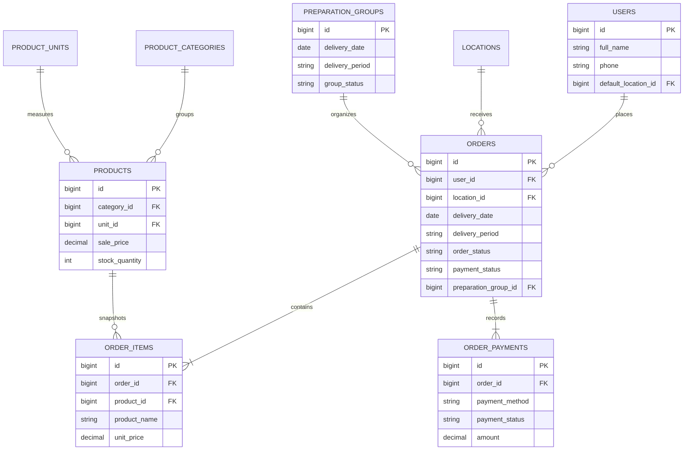

# แนวคิดด้านการค้าและการเก็บข้อมูลถาวร

`specs/database/schema.sql` เป็นแหล่งอ้างอิงโครงสร้างฐานข้อมูลเพียงไฟล์เดียวของ repository และไม่ได้ใช้ migration directory. API ใช้ตารางนี้เป็นข้อมูลจริงสำหรับ [workflow คำสั่งซื้อและการจัดส่ง](workflows/orders-and-fulfillment.md); อย่าสร้างโมเดล local ที่ซ้ำกับ domain เหล่านี้เมื่อเพิ่มฟีเจอร์.

ไดอะแกรมสะท้อนตารางและ foreign key ที่ใช้กับ API; `order_items` เก็บชื่อสินค้า หน่วย และราคาเป็น snapshot ขณะที่ `product_id` nullable ได้เพื่อเก็บหลักฐานรายการแม้สินค้าเปลี่ยนในอนาคต.

## เอนทิตีหลัก

| แนวคิด | หน้าที่ | ฟิลด์/กฎสำคัญ |
| --- | --- | --- |
| `admin` | ผู้ดูแลแยกจากผู้ใช้ | username, password hash, profile และ `super_admin`; ใช้ session admin |
| `users` | บัญชีผู้ใช้หน้าร้าน | ชื่อ, phone, password hash, `default_location_id`, active flag |
| `locations` | จุดรับหรือส่ง | order ต้องมี `location_id`; user ใช้เป็นสถานที่ตั้งต้น |
| `products` | สินค้าที่ขายได้ | ราคา, active flag, stock แบบจำนวนขายและจำนวนชิ้น; category กำหนดว่าติดตามชิ้นหรือไม่ |
| `orders` | ส่วนหัวของคำสั่งซื้อ | วัน/รอบส่ง, status การจัดการและการชำระเงินแยกกัน, ยอดรวมและเวลาเหตุการณ์ |
| `order_items` | snapshot รายการใน order | product, ชื่อ, หน่วย, จำนวน, ราคา, ยอดบรรทัด |
| `order_payments` | ระเบียนการชำระ | method, status, amount, เวลา paid/verified และผู้ตรวจ |
| `preparation_groups` | รอบเตรียมสินค้า | วัน/รอบ, `preparing` หรือ `ready`; order ชี้กลับผ่าน `preparation_group_id` |
| `settings` | รอบส่ง, popup, advertisement และ badge | cutoff และช่วงส่งถูกใช้ทั้ง UI และ validation การสร้าง order |

`orders.order_status` ใช้ `pending_payment`, `pending_review`, `preparing`, `ready_for_delivery`, `delivered`, `cancelled`; `payment_status` ใช้ `pending`, `paid`, `rejected`, `refunded`. แยกสองแกนนี้เพื่อให้ [workflow ฝั่งผู้ดูแล](workflows/orders-and-fulfillment.md#วงจรการจัดการคำสั่งซื้อฝั่งผู้ดูแล) รับเฉพาะ order ที่จ่ายแล้วเข้าสาย preparation.

## ความสมบูรณ์ของข้อมูลและข้อจำกัด

การสร้าง order ใน `backend/src/user/orders/repository.php` ใช้ transaction และ `FOR UPDATE`, ตรวจ active/stock, คำนวณยอดจากฐานข้อมูล และลด stock ก่อนสร้าง order/item/payment หากสินค้าไม่พอจะ rollback ทั้งชุด. สินค้าที่ category ติดตามจำนวนชิ้นใช้ `stock_piece_count` และ `pieces_per_sale` เพื่อคำนวณ `stock_quantity` ใหม่.

`preparation_groups.location_id` nullable และ repository สร้าง group ข้ามจุดรับได้; delivery view จึงจัดกลุ่มตาม location ของ order ไม่ใช่ location ของ group. `created_by` ของ group ยังไม่ถูกเติม เพราะ schema ชี้ไป `users` ไม่ใช่ `admin`; เป็นข้อจำกัดที่ต้องตัดสินใจหากต้อง audit ผู้ดูแลผู้ปฏิบัติงาน.

การเปลี่ยน schema ต้องแก้ `specs/database/schema.sql` ให้เป็นผลลัพธ์สุดท้าย และแจ้งคำสั่ง `ALTER TABLE` สำหรับฐานข้อมูลเดิมตาม `AGENTS.md`; หลังเปลี่ยน state/data model ให้ตรวจ API contract และ flow ใน [สถาปัตยกรรม](architecture/overview.md#ความเป็นเจ้าของสถานะ) ด้วย.
