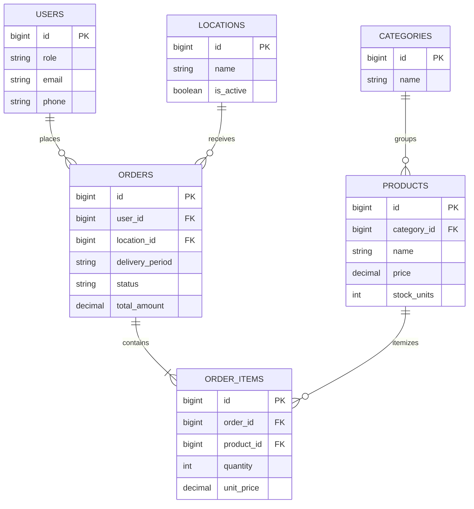

# แนวคิดด้านการค้าและช่องว่างของการเก็บข้อมูลถาวร

`database/schema.sql` เป็นคำอธิบายที่ถือเป็นหลักของเอนทิตีการค้าแบบถาวรที่ตั้งใจไว้ ส่วน frontend ใช้ออบเจกต์แบบ static หรือ local ที่มีรูปทรงแยกต่างหากเพื่อสร้างต้นแบบการโต้ตอบของลูกค้าและผู้ดูแล หน้านี้ทำให้ส่วนที่ทับซ้อนและช่องว่างชัดเจนขึ้น เพื่อให้การเปลี่ยนแปลงมุ่งไปสู่โมเดลเดียว แทนที่จะตอกย้ำแหล่งข้อมูลจริงที่ขนานกันหลายแหล่ง

ไดอะแกรมนี้สะท้อน foreign key และฟิลด์ใน `database/schema.sql`; ตัว `user_id` เองเป็น nullable แม้ว่าคำสั่งซื้อจะต้องมี location ที่จำเป็นก็ตาม

## แนวคิดที่ถูกจัดเก็บถาวร

| แนวคิด | หน้าที่ใน schema | ฟิลด์สำคัญ |
| --- | --- | --- |
| ผู้ใช้ (User) | ตัวตนของลูกค้า/ผู้ดูแล และ metadata ของ credential/provider | role, email/password hash (ไม่บังคับ), ชื่อ/ชื่อเล่น, เบอร์โทร, LINE ID, provider แบบ `web` หรือ `google` |
| สถานที่ (Location) | จุดรับ/จัดส่งที่สามารถปิดใช้งานได้ | name, `is_active` |
| หมวดหมู่ (Category) | การจัดกลุ่มสินค้า | name |
| สินค้า (Product) | ระเบียนในแคตตาล็อกที่ขายได้และ metadata ของสต็อก | category, description/image path, ราคา, จำนวนสต็อก, จำนวนหน่วยต่อการขาย, active flag |
| คำสั่งซื้อ (Order) | ส่วนหัวเชิงการค้าและสถานะที่เกี่ยวกับการชำระเงิน | user (ไม่บังคับ), location (จำเป็น), ช่วงเช้า/บ่าย, `pending_payment` / `paid` / `cancelled`, วิธีชำระเงิน, slip path (ไม่บังคับ), ยอดรวม |
| รายการคำสั่งซื้อ (Order item) | สแนปช็อตของจำนวนสินค้าและราคาต่อหน่วย | order, product, quantity, unit price |

ฟิลด์ `slip_path` ใน schema และไดเรกทอรีจัดเก็บ placeholder ของ backend (`backend/storage/slips/`) บ่งชี้ถึงความสามารถในการเก็บหลักฐานการชำระเงินที่ตั้งใจไว้ แต่ [workflow ฝั่งลูกค้า](workflows/orders-and-fulfillment.md#ขั้นตอนการสั่งซื้อของลูกค้า) ยังไม่มีพฤติกรรมการอัปโหลดหรือส่งข้อมูล เช่นเดียวกัน `backend/storage/products/` บ่งชี้ว่ามีแผนจะเก็บสื่อของสินค้า แต่ยังไม่ได้ให้บริการผ่าน API ที่มีเอกสารกำกับ

## แนวคิดฝั่งลูกค้า

UI ฝั่งลูกค้าในปัจจุบันมีแคตตาล็อก static ขนาดเล็ก และรายการในตะกร้าที่แสดงเป็น `productId` พร้อม `quantity` มีการเลือก `morning` หรือ `afternoon`, แสดงผู้รับ/สถานที่ และแสดงยอดเงิน สิ่งเหล่านี้จับคู่ได้อย่างเป็นธรรมชาติกับแนวคิด order, order item, product, user และ location แต่การพัฒนายังไม่ได้ส่งข้อมูลเหล่านั้น

การชำระเงินที่รองรับด้วยเซิร์ฟเวอร์ควรทำให้ความสัมพันธ์ต่อไปนี้ชัดเจน:

- product ID และ quantity ในตะกร้า **กลายเป็น** order item ที่เชื่อมกับ product ตัวจริง (canonical)
- ช่วงเวลาจัดส่งที่เลือกและ location ของบัญชี **กลายเป็น** `delivery_period` และ `location_id` ของคำสั่งซื้อ
- ตัวตนตอนชำระเงิน **กลายเป็น** ความสัมพันธ์ order-user แบบ nullable หรือ required ตามนโยบายคำสั่งซื้อแบบ guest ที่ตกลงกันไว้
- ยอดรวมที่คำนวณต้องถูกคำนวณใหม่จากราคาสินค้าที่เชื่อถือได้ทางฝั่งเซิร์ฟเวอร์ ก่อนบันทึก `total_amount`
- การจัดการ QR ชำระเงินและ slip (ไม่บังคับ) ควรอัปเดตกระบวนการชำระเงินที่กำหนดไว้ ไม่ใช่แค่สลับสถานะ UI ในเครื่อง

แนวคิดเหล่านี้ต้องถูกนำเข้ามาผ่าน [ขอบเขต API ของสถาปัตยกรรม](architecture/overview.md#ขอบเขตการเชื่อมต่อในปัจจุบัน) แทนที่จะขยายตะกร้าที่อยู่ฝั่ง client อย่างเดียวไปเป็น local data store อีกตัวหนึ่ง

## แนวคิดการปฏิบัติงานฝั่งผู้ดูแล

`AdminOrder` ของ frontend เพิ่มฟิลด์และสถานะที่ตั้งใจไว้สำหรับการจัดการคำสั่งซื้อ ได้แก่ วันที่จัดส่ง, ฟิลด์แสดงข้อมูลลูกค้า, ป้ายหน่วยของสินค้า และสองสถานะที่แยกกันอย่างอิสระ:

- payment: `รอชำระเงิน` หรือ `จ่ายแล้ว`
- operations: `รอชำระเงิน`, `รอตรวจสอบ`, `เตรียมสินค้า`, `พร้อมส่ง`, `ส่งแล้ว`, `ยกเลิก`

`PreparationBatch` จัดกลุ่มคำสั่งซื้อที่จ่ายแล้วในขั้นตอนตรวจสอบ ตามวันที่จัดส่งและช่วงเวลา ประกอบด้วย ID, รายการ order ID ที่อยู่ในนั้น, สถานะ `preparing` หรือ `ready` และ timestamp ของการสร้าง [workflow การจัดการคำสั่งซื้อ](workflows/orders-and-fulfillment.md#กฎการจัดชุดและการจัดส่งที่กำหนดไว้ใน-store) เป็นเจ้าของความหมายของการเปลี่ยนสถานะนี้

## ความไม่ตรงกันระหว่าง UI กับ schema

| ส่วน | ความไม่ตรงกันในปัจจุบัน | การตัดสินใจที่ต้องทำก่อนพัฒนา |
| --- | --- | --- |
| สถานะการจัดการคำสั่งซื้อ | schema หยุดที่ pending payment, paid, cancelled; แต่ UI ดำเนินต่อผ่าน review, preparation, ready, dispatched | เพิ่มสถานะ fulfillment แยกต่างหาก หรือขยาย/นิยาม contract สถานะคำสั่งซื้อใหม่ |
| วันที่จัดส่ง | workflow ฝั่งผู้ดูแลกรองตามวันที่จัดส่ง; แต่ schema เก็บเพียง `ordered_at` | เพิ่มวันที่ที่ร้องขอ/จัดส่ง พร้อม index ที่เหมาะกับ query เชิงปฏิบัติการ |
| สถานที่ | schema ใช้ `location_id`; แต่คำสั่งซื้อจำลองฝั่งผู้ดูแลใช้ชื่อสถานที่สำหรับแสดงผล | API ควรคืนทั้งตัวระบุที่คงที่และชื่อสำหรับแสดงผล ไม่ใช่แทน foreign key ด้วยชื่อ |
| ผู้ใช้/ลูกค้า | ตาราง `users` ใน schema สามารถจำลองทั้งลูกค้าและผู้ดูแลได้; แต่ UI มี dialog ที่ยังไม่ยืนยันตัวตน และมีโมเดล admin-user แบบ local แยกต่างหาก | กำหนดการยืนยันตัวตน, สิทธิ์ตามบทบาท, คำสั่งซื้อแบบ guest และว่าระเบียนผู้ติดต่อฝั่งผู้ดูแลเป็นบัญชีลูกค้าหรือไม่ |
| แคตตาล็อก | สินค้าฝั่งลูกค้า, สินค้าฝั่งผู้ดูแล และชื่อ/ราคาของรายการคำสั่งซื้อจำลอง เป็นชุดข้อมูลที่แยกกัน | กำหนด API สินค้าตัวจริง (canonical) และกฎการทำสแนปช็อตราคา |
| การชำระเงิน | schema มีวิธีชำระเงินและ slip path (ไม่บังคับ); แต่ UI มี QR แบบตายตัวและตัวเลือกการชำระเงินแบบ local | กำหนดคำแนะนำเรื่อง provider/การชำระเงิน, ความปลอดภัยของการอัปโหลดหลักฐาน, ผู้ทำหน้าที่ตรวจสอบ และร่องรอยการตรวจสอบ (audit trail) |
| ชุดการเตรียมสินค้า | ไม่มีตาราง batch ใน schema | ตัดสินใจว่าสมาชิก/ประวัติของ batch เป็นข้อมูลธุรกิจถาวร หรือเป็นมุมมองเชิงปฏิบัติการที่ได้มาจากข้อมูลอื่น |

อย่าคิดว่าเพียงแค่เปลี่ยน enum ของสถานะจะปิดช่องว่างนี้ได้ วงจรการทำงานมีการดำเนินการกับ batch ที่มีการป้องกันและการจัดกลุ่มการจัดส่ง ขณะที่ฐานข้อมูลต้องการกลยุทธ์ audit/ประวัติ และการทำงานพร้อมกัน (concurrency) ที่ชัดเจน ดู [การดำเนินการและการทดสอบ](operations.md#หมายเหตุด้านการเชื่อมต่อระบบและความปลอดภัย) สำหรับข้อจำกัดที่ต้องมาพร้อมกับการเปิดใช้ API
