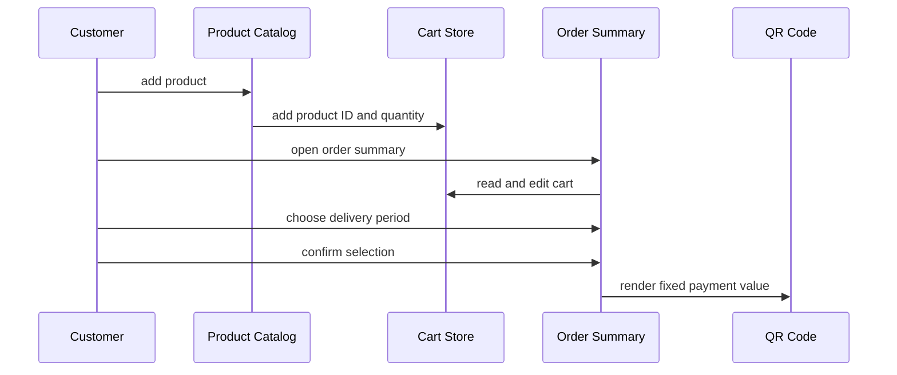
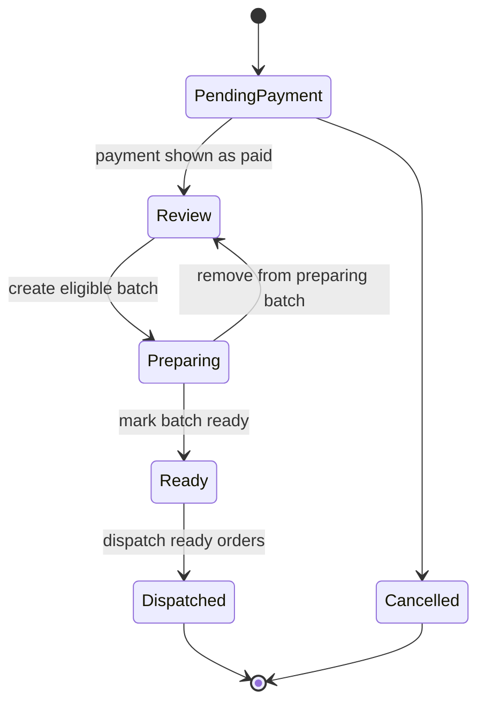

# workflow คำสั่งซื้อและการจัดส่ง

หน้านี้บันทึกสิ่งที่ UI ทำจริงในปัจจุบัน ไม่ใช่กระบวนการ production ที่เสนอไว้ การชำระเงินฝั่งลูกค้าเป็น flow เชิงภาพในเครื่อง ขณะที่ workspace ฝั่งผู้ดูแลสาธิตวงจรการเตรียมสินค้าในเครื่องที่ละเอียดกว่าโดยใช้คำสั่งซื้อจำลอง ทั้งสองส่วนไม่ได้เชื่อมต่อกันด้วย API หรือระเบียนฐานข้อมูลที่ใช้ร่วมกัน

## ขั้นตอนการสั่งซื้อของลูกค้า

`ProductCatalog` เพิ่ม product ID แบบ static เข้าไปในตะกร้า Zustand ที่เก็บสถานะไว้ `StorefrontHeader` และ `StickyCart` คำนวณยอดรวมสำหรับแสดงผลโดยเชื่อม ID เหล่านั้นกลับไปยังข้อมูลสินค้าฝั่งลูกค้าแบบ static ปุ่ม sticky จะเปิด `/order-summary`

การยืนยันไปถึงเพียงการแสดงการชำระเงินเท่านั้น ไม่ได้ส่งคำสั่งซื้อ, ตรวจสอบการชำระเงิน, อัปโหลด slip หรือล้าง `lookchin-cart-v1`

### จุดอ้างอิงการพัฒนาฝั่งลูกค้า

- `frontend/src/features/customer/home/ProductCatalog.tsx` เรียกใช้ `useCartStore.addItem`
- `frontend/src/stores/cart-store.ts` เก็บ `{ productId, quantity }` และลบรายการเมื่อจำนวนเป็นศูนย์
- `frontend/src/pages/customer/OrderSummaryPage.tsx` ให้ลูกค้าเลือก `morning` หรือ `afternoon`, คำนวณยอดรวมในเครื่อง และสลับสถานะ component `isOrderConfirmed`
- QR code ชำระเงินใช้ค่าตายตัว `LOOKCHIN_LOR_LUEAN_PAYMENT_TEMPLATE` ข้อมูลผู้รับในหน้านี้ถูก hard-code ไว้
- `frontend/src/pages/customer/MyOrdersPage.tsx` เป็นหน้าประวัติที่ hard-code แยกต่างหาก ไม่ใช่ผลลัพธ์จากการชำระเงิน
- `frontend/src/features/customer/shared/AuthDialogs.tsx` ทำเพียงการตรวจสอบฝั่ง client การสมัครสมาชิกอ่านสถานที่รับสินค้าที่เปิดใช้งานจากโมดูล location ที่เก็บใน local-storage ฝั่งผู้ดูแล จึงไม่ใช่ flow การเก็บข้อมูลผู้ใช้/บัญชีอย่างถาวร

[โมเดล domain](../domain-model.md#แนวคิดฝั่งลูกค้า) แสดงว่า input ในเครื่องนี้จะจับคู่ไปยังระเบียนถาวรที่จุดใด ก่อนแก้ไขการชำระเงินหรือการ checkout ให้อ่าน [ขอบเขตการเชื่อมต่อของสถาปัตยกรรม](../architecture/overview.md#ขอบเขตการเชื่อมต่อในปัจจุบัน): มี API client แบบทั่วไปอยู่แล้วแต่ยังไม่ถูกใช้งาน

## วงจรการจัดการคำสั่งซื้อฝั่งผู้ดูแล

แดชบอร์ดผู้ดูแล, หน้าคำสั่งซื้อ, กระดานเตรียมสินค้า และหน้าจัดส่ง ล้วนอ่านและแก้ไข `usePreparationStore` โดยมีข้อมูลตั้งต้นเป็น `mockOrders` และเก็บไว้ในเบราว์เซอร์ภายใต้ `lookchin-admin-preparation-v2` จึงเหมาะสำหรับการสร้างต้นแบบ interface แต่ไม่ใช่การประสานงานเชิงปฏิบัติการที่ใช้ร่วมกัน

สิ่งนี้แสดงถึงคำศัพท์ UI ที่ตั้งใจไว้ หน้ารายละเอียดในปัจจุบันบันทึกเพียงสถานะคำสั่งซื้อ ไม่ได้บันทึกสถานะการชำระเงินที่เลือกแยกต่างหาก; ดู **ข้อจำกัดของการพัฒนาที่ทราบอยู่** ด้านล่าง

### กฎการจัดชุดและการจัดส่งที่กำหนดไว้ใน store

`frontend/src/features/admin/preparation/preparation-store.ts` พัฒนาส่วนของวงจรที่มีข้อจำกัดมากที่สุด:

- `createBatch` รับคำสั่งซื้อที่เลือกเฉพาะเมื่อวันที่และช่วงเวลาตรงกับ batch, การชำระเงินเป็น `จ่ายแล้ว` และสถานะเป็น `รอตรวจสอบ`; คำสั่งซื้อที่รับจะกลายเป็น `เตรียมสินค้า`
- `markBatchReady` เปลี่ยนทุกคำสั่งซื้อใน batch เป็น `พร้อมส่ง` และทำเครื่องหมาย batch เป็น `ready`
- `removeOrderFromBatch` อนุญาตเฉพาะระหว่างที่ batch กำลังเตรียมสินค้า; จะคืนคำสั่งซื้อกลับเป็น `รอตรวจสอบ` และลบ batch ที่ว่างเปล่า
- `DispatchTodayPage` จัดกลุ่มคำสั่งซื้อที่จ่ายแล้วและไม่ถูกยกเลิกตามสถานที่ สำหรับวันที่ `2026-07-20` ที่ hard-code ไว้ การดำเนินการจะเปลี่ยนเฉพาะคำสั่งซื้อ `พร้อมส่ง` ที่สถานที่นั้นให้เป็น `ส่งแล้ว`

รูปทรงของคำสั่งซื้อเชิงปฏิบัติการและคำศัพท์สถานะภาษาไทยอยู่ใน `frontend/src/features/admin/orders/order-data.ts` [ภาพรวมสถาปัตยกรรม](../architecture/overview.md#ความเป็นเจ้าของสถานะ) อธิบายว่าทำไม store นี้ ไม่ใช่ MySQL จึงเป็นแหล่งอ้างอิงฝั่งผู้ดูแลที่เห็นได้ในปัจจุบัน

## ข้อจำกัดของการพัฒนาที่ทราบอยู่

- **ไม่มีการส่งต่อจากลูกค้าไปยังผู้ดูแล:** การยืนยันของลูกค้าไม่ได้สร้างคำสั่งซื้อจำลองฝั่งผู้ดูแล API ในอนาคตต้องสร้างคำสั่งซื้อและรายการสินค้าแบบ transaction แล้วเปิดให้ทั้งสองฝั่งเข้าถึง
- **สถานะการชำระเงินไม่ถูกเก็บจากหน้ารายละเอียด:** `OrderDetailPage` เก็บ `paymentStatus` ไว้ใน state ของ component แต่ปุ่ม Save เรียก `setOrdersStatus` ซึ่งบันทึกเพียง `status` เท่านั้น การเปลี่ยนการชำระเงินเป็นจ่ายแล้วจึงไม่ทำให้คำสั่งซื้อมีสิทธิ์อย่างถาวรหลังการนำทาง/โหลดหน้าใหม่
- **การแก้สถานะโดยตรงสามารถข้ามวงจรได้:** การดำเนินการในหน้ารายละเอียดและรายการคำสั่งซื้อใช้ `setOrdersStatus` แบบทั่วไป; ไม่ได้บังคับกฎการเปลี่ยนสถานะของ batch/การจัดส่ง
- **ค่าของเวลา/ข้อมูลเป็น fixture ของต้นแบบ:** แถวเชิงปฏิบัติการส่วนใหญ่และการกรองการจัดส่งใช้ `2026-07-20`; เวลาตัดรอบการจัดส่งของลูกค้าและผู้ดูแลถูกทำซ้ำในโมดูลแยกกัน
- **ตัวตนของสินค้า/สถานที่ไม่ตรงกัน:** รายการคำสั่งซื้อฝั่งผู้ดูแลและแคตตาล็อกฝั่งลูกค้าเป็นชุด static ที่แยกกัน ขณะที่สถานที่ถูกแทนด้วยชื่อในคำสั่งซื้อจำลอง แทนที่จะเป็นความสัมพันธ์แบบ typed ที่คงที่

สิ่งเหล่านี้ไม่ใช่แค่ข้อบกพร่องของ UI: มันเกิดขึ้นเพราะ [schema](../domain-model.md#ความไม่ตรงกันระหว่าง-ui-กับ-schema) มีเพียงสถานะคำสั่งซื้อที่เน้นการชำระเงิน และชั้นเซิร์ฟเวอร์ไม่มี endpoint สำหรับคำสั่งซื้อ ให้ถือว่าการออกแบบสถานะ, หลักฐานการชำระเงิน และการจับคู่ตัวตนเป็นการเปลี่ยนแปลงข้ามชั้นครั้งเดียวกัน

## พัฒนาการล่าสุด

commit ล่าสุดมุ่งไปที่การปรับปรุง UI เชิงปฏิบัติการฝั่งผู้ดูแลทีละน้อย: การเปลี่ยนสถานะและตัวกรองการเตรียมสินค้า/การจัดส่งกระจุกอยู่รอบ `PreparationBoard`, `preparation-store`, `DispatchTodayPage` และ `order-data`; `249d8ff` เพิ่มพฤติกรรมรายละเอียดคำสั่งซื้อฝั่งผู้ดูแล ลำดับฟีเจอร์ล่าสุด (`f2b2383` ตามด้วย `ee387d0`) เพิ่มการนำทางข้อความตรง, การเก็บข้อความในเครื่อง, หน้าจอแชท และการปรับขนาดไอคอน สิ่งนี้แสดงว่า repository ในปัจจุบันพัฒนาผ่าน patch frontend แบบเจาะจง ไม่ใช่ vertical slice ฝั่ง backend ที่เสร็จสมบูรณ์
