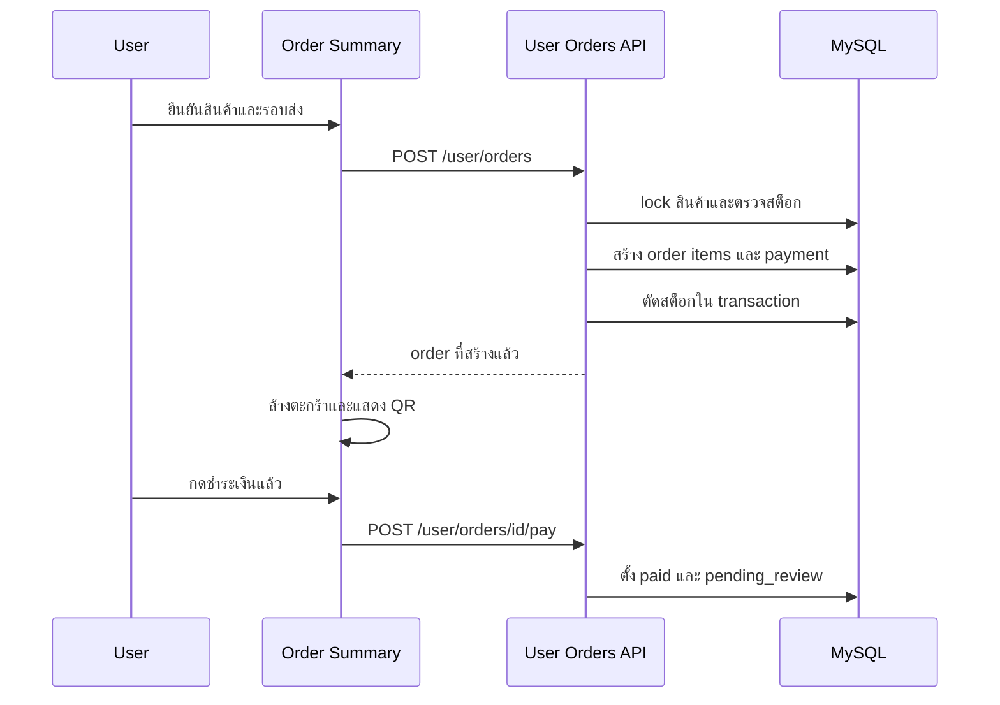
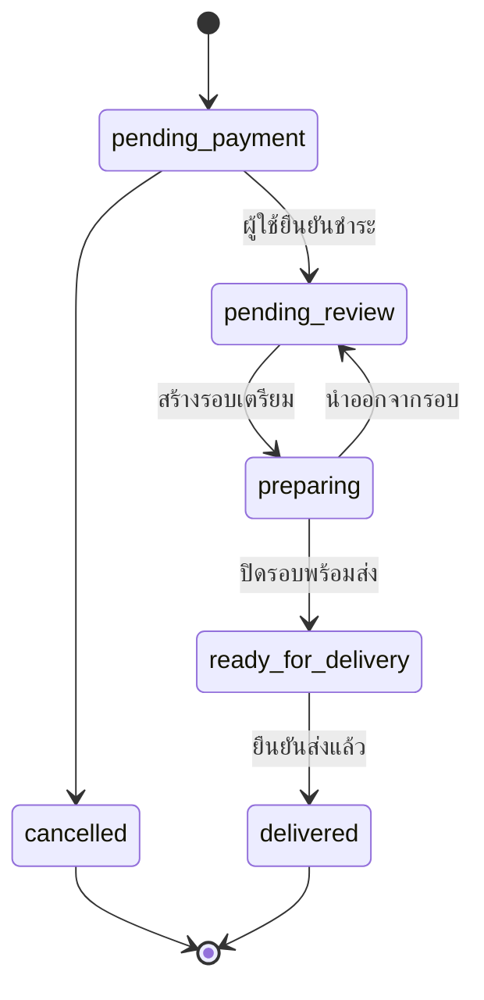

# workflow คำสั่งซื้อและการจัดส่ง

หน้าจอและ API ใช้ข้อมูลเดียวกันผ่าน MySQL: ผู้ใช้สร้าง order จากตะกร้า ส่วนผู้ดูแลตรวจสอบ, จัดเข้ารอบเตรียม และส่งสินค้า [โมเดล domain](../domain-model.md) เป็นเจ้าของนิยามตารางและสถานะ; หน้านี้เป็นเจ้าของลำดับการทำงานและ guard ของแต่ละการเปลี่ยนสถานะ.

## ขั้นตอนการสั่งซื้อและชำระเงินของผู้ใช้

`OrderSummaryPage` โหลดสินค้า, การตั้งค่ารอบส่ง และ session ผู้ใช้ผ่าน React Query ผู้ใช้ต้องเข้าสู่ระบบ, มี `locationId`, เลือกรอบ และมีสินค้าในตะกร้าก่อนเรียก `POST /user/orders` จาก `frontend/src/api/user/orders.ts`.

ภาพนี้แสดง flow ที่ `backend/src/user/orders/routes.php` และ `repository.php` ตรวจจริง: backend ตรวจ cutoff จาก `settings`, lock สินค้าด้วย `FOR UPDATE`, คำนวณยอดจาก `sale_price` ในฐานข้อมูล, ตอบ shortage ทั้งหมดพร้อมกัน และสร้าง `orders`, `order_items`, `order_payments` ก่อน commit. หลังสร้างสำเร็จ UI ล้างตะกร้า; การกดชำระเงินแล้วทำให้ `payment_status=paid`, `order_status=pending_review` และตั้ง `paid_at`.

การยืนยันดังกล่าวยังไม่ยืนยันจากผู้ให้บริการชำระเงิน: QR เป็นค่าที่สร้างจากเลข order/ยอดเงิน และ endpoint ไม่มี gateway, webhook, slip upload หรือ timeout enforcement. ห้ามสื่อสารว่าเป็นการชำระเงินจริงที่ตรวจสอบโดยระบบภายนอก.

## วงจรการจัดการคำสั่งซื้อฝั่งผู้ดูแล

API admin อ่านและเปลี่ยน order ใน MySQL; route `/admin/*` ถูกคุมด้วย session ตาม [สถาปัตยกรรม](../architecture/overview.md#การกำหนดเส้นทางคำขอและการยืนยันตัวตน). ผู้ดูแลดูและกรอง order ผ่าน `/admin/orders`; bulk status กัน order ที่ยังไม่ `paid`, ส่วนหน้ารายละเอียดสามารถเปลี่ยน payment และ order status ผ่าน `POST /admin/orders/:id`.

state machine นี้สอดคล้องกับ `orders.order_status` และ guard ใน `backend/src/admin/preparations/routes.php`; admin detail/bulk route มีความสามารถแก้ status โดยตรง จึงต้องระวังไม่ข้ามกฎเชิงปฏิบัติการเมื่อขยายระบบ.

## กฎการจัดรอบเตรียมและส่งสินค้า

`GET /admin/preparations` คืน queue, batch และ delivery group ตามวัน/รอบ/จุดรับ. `POST /admin/preparations` ยอมรับเฉพาะ order ที่วันและรอบตรงตัวกรอง, `payment_status=paid`, `order_status=pending_review` และยังไม่มี `preparation_group_id`; transaction สร้าง `preparation_groups` แล้วเปลี่ยน order เป็น `preparing`.

- ลบ order จาก batch ได้เฉพาะ batch ที่ยัง `preparing`; order กลับ `pending_review` และลบ batch หากว่าง
- ปิด batch เปลี่ยนสมาชิก `preparing` เป็น `ready_for_delivery`, บันทึก `ready_at` และตั้ง group เป็น `ready`
- delivery view รวมสมาชิกกลุ่มที่ปิดแล้วตาม `location_id`; `POST /admin/preparations/delivered` เปลี่ยนเฉพาะ order ที่ `ready_for_delivery` เป็น `delivered` พร้อม `delivered_at`
- group เตรียมหนึ่งกลุ่มไม่ผูกจุดรับ เพราะ repository สร้างโดยไม่มี `location_id`; การส่งจึงค่อยรวมตามจุดรับในภายหลัง

เมื่อแก้ workflow ให้แก้ validation/route/repository และ UI hook พร้อมกัน แล้วทดสอบ transaction, status guard และผลการตัดสต็อกตาม checklist ใน [การดำเนินการ](../operations.md#การตรวจสอบและการทดสอบ).
